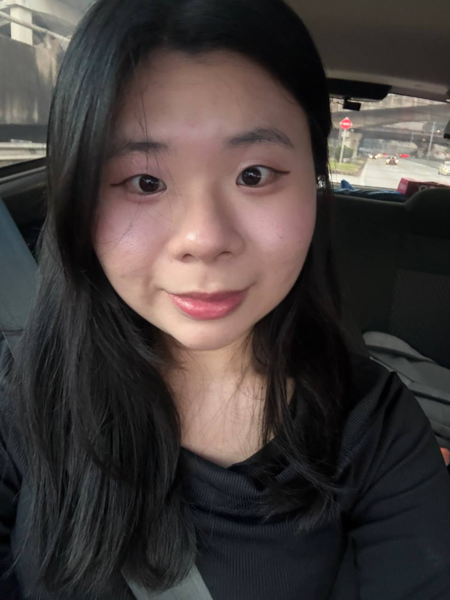

# Introduction
Hi! I'm Chang Cai Ting, a final-year Software Engineering student at University of Malaya. I'm currently enrolled in the Software Maintenance and Evolution course. I think this course will be a great chance for me to fulfil my curiosity on how an app is maintained and managed, and how well it needs to be.

- **Fun fact**: I'm a matcha lover and currently just starting to make my own matcha drinks :)
- **Course expectations**: To get hands-on practice reading messy old code, fixing bugs without breaking other things, and collaborating properly through Git.

